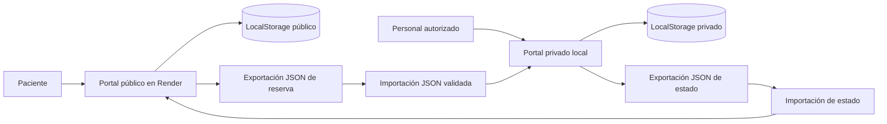

# Solución de Nube Híbrida para la Clínica Santivañez

Proyecto académico completo de dos portales estáticos separados: un portal público de citas preparado para Render y un portal privado que debe ejecutarse únicamente en una computadora local mediante Docker. Todos los nombres, documentos, contactos, diagnósticos y tratamientos incluidos son ficticios.

> **Advertencia:** esta solución no está preparada para almacenar información médica real. `LocalStorage`, `SessionStorage`, las credenciales visibles y la sincronización por archivos son recursos de demostración, no controles de seguridad suficientes para producción.

## 1. Título

**Solución de Nube Híbrida para la Clínica Santivañez**

## 2. Descripción del problema

La clínica necesita ofrecer agenda de citas fuera de sus instalaciones sin publicar historias clínicas ni información médica confidencial. El prototipo separa la coordinación pública de citas de la gestión clínica local y demuestra un intercambio controlado con archivos JSON.

## 3. Objetivo general

Construir un prototipo académico de nube híbrida, basado exclusivamente en HTML5, CSS3, JavaScript puro, JSON, almacenamiento del navegador, Docker y Nginx, que permita reservar citas públicamente y administrar información clínica ficticia en un entorno privado local.

## 4. Objetivos específicos

- Publicar únicamente información institucional, especialidades, médicos ficticios y coordinación mínima de citas.
- Mantener pacientes, historias, diagnósticos y tratamientos ficticios en `private-cloud`.
- Simular autenticación, roles y auditoría sin presentar esos mecanismos como seguridad real.
- Demostrar el intercambio mínimo entre entornos mediante exportación e importación JSON validada.
- Preparar el portal público para GitHub y un Web Service Docker en Render.
- Documentar arquitectura, clasificación, seguridad, despliegue, pruebas y limitaciones.

## 5. Alcance

Incluye dos aplicaciones web estáticas, persistencia local por navegador, generación de UUID con Web Crypto API, reserva, consulta, cancelación, recordatorios simulados, gestión de citas, pacientes e historias ficticias, control de roles simulado, auditoría local y sincronización manual.

No incluye backend, base de datos, API, envío de mensajes, integración automática, cifrado de datos en reposo, identidad federada, expediente clínico real ni disponibilidad multiusuario.

## 6. Tecnologías

- HTML5 semántico.
- CSS3 responsive sin librerías externas.
- JavaScript puro, Web Crypto API, LocalStorage y SessionStorage.
- Archivos JSON con datos ficticios.
- Nginx 1.27 Alpine.
- Docker y Docker Compose.
- Git y GitHub.
- Render Web Service basado en Docker para `public-cloud`.

No existen dependencias de Node.js, frameworks de frontend, backend o bases de datos.

## 7. Arquitectura híbrida



Render contiene solo el portal público. Los datos médicos permanecen en el entorno privado porque su sensibilidad exige controles que este prototipo estático no puede proporcionar. El intercambio se limita a información mínima de coordinación de una cita y representa separación y control, no una integración híbrida automática.

Flujo esperado: **código local → GitHub → Render → portal público**.

## 8. Clasificación de la información

| Información | Clasificación | Ubicación |
| --- | --- | --- |
| Historia clínica | Crítica y sensible | Entorno privado |
| Diagnóstico | Crítica y sensible | Entorno privado |
| Tratamiento | Crítica y sensible | Entorno privado |
| Datos completos del paciente | Confidencial | Entorno privado |
| UUID de reserva | Restringida | Ambos entornos |
| Fecha y hora de cita | Uso limitado | Entorno público |
| Especialidad | Uso limitado | Entorno público |
| Contacto mínimo | Personal protegido | Entorno público |
| Estado de cita | Uso limitado | Ambos entornos |
| Información institucional | Pública | Render |

La matriz ampliada y sus reglas están en [`docs/clasificacion-datos.md`](docs/clasificacion-datos.md).

## 9. Estructura de carpetas

```text
clinica-santivanez-hibrida/
├── public-cloud/
│   ├── index.html
│   ├── especialidades.html
│   ├── medicos.html
│   ├── reservar.html
│   ├── consultar.html
│   ├── recordatorios.html
│   ├── sincronizacion.html
│   ├── css/styles.css
│   ├── js/{app,data,reservas,validaciones,almacenamiento,sincronizacion}.js
│   ├── data/{especialidades,medicos,reservas-ejemplo}.json
│   ├── nginx/default.conf.template
│   ├── Dockerfile
│   └── .dockerignore
├── private-cloud/
│   ├── login.html
│   ├── dashboard.html
│   ├── pacientes.html
│   ├── historias.html
│   ├── citas.html
│   ├── auditoria.html
│   ├── sincronizacion.html
│   ├── css/styles.css
│   ├── js/{auth,data,pacientes,historias,citas,auditoria,almacenamiento,sincronizacion,app}.js
│   ├── data/{pacientes,historias,reservas,auditoria}.json
│   ├── nginx.conf
│   ├── Dockerfile
│   └── .dockerignore
├── docs/
│   ├── arquitectura-hibrida.md
│   ├── clasificacion-datos.md
│   ├── seguridad.md
│   ├── despliegue-local.md
│   ├── despliegue-render.md
│   ├── pruebas.md
│   └── evidencias.md
├── docker-compose.yml
├── render.yaml
├── .gitignore
└── README.md
```

## 10. Funcionalidades públicas

- Página institucional con aviso de privacidad.
- Cinco especialidades y cinco médicos ficticios con horarios.
- Reserva con validación de nombre, correo, teléfono, fecha futura, médico, día y hora.
- Prevención de duplicados por correo, médico, fecha y hora.
- UUID v4 mediante `crypto.randomUUID()` y alternativa con `crypto.getRandomValues()`.
- Persistencia en LocalStorage del navegador.
- Consulta y cancelación con confirmación.
- Consentimiento obligatorio y recordatorios visuales simulados.
- Exportación de reserva e importación de respuesta JSON.
- Estados vacío, carga, error, confirmación y éxito.
- Identificación automática: “Entorno público: Render Cloud” fuera de localhost y “Entorno local de demostración” en localhost.

## 11. Funcionalidades privadas

- Inicio y cierre de sesión simulados mediante SessionStorage.
- Protección de páginas y navegación condicionada por rol.
- Panel con pacientes, citas, pendientes, historias y actividad reciente.
- Ocho pacientes ficticios iniciales.
- Diez reservas iniciales con estados variados.
- Seis historias clínicas completamente ficticias.
- Diez registros iniciales de auditoría; las nuevas acciones se añaden automáticamente.
- Alta administrativa de pacientes ficticios.
- Registro de diagnósticos y tratamientos ficticios por médico o administrador.
- Importación estricta de reservas, prevención de UUID duplicado y gestión de estados.
- Exportación de respuestas mínimas.
- Reinicio confirmado de datos de demostración, disponible al administrador.

## 12. Credenciales de demostración

| Rol | Usuario | Contraseña | Permisos principales |
| --- | --- | --- | --- |
| Administrador | `administrador` | `Admin2026*` | Panel, usuarios simulados, todos los registros, auditoría, sincronización y reinicio |
| Recepción | `recepcion` | `Recep2026*` | Pacientes, citas, importación y exportación de estados |
| Médico | `medico` | `Medico2026*` | Pacientes e historias asignadas; citas propias en consulta |

Estas credenciales están visibles en el código. No ofrecen autenticación real y no deben usarse ni reutilizarse en producción.

## 13. Ejecución sin Docker

Los archivos pueden abrirse directamente:

- Portal público: abrir `public-cloud/index.html`.
- Portal privado: abrir `private-cloud/login.html`.

En modo `file://`, algunos navegadores aplican restricciones propias. Las aplicaciones no dependen de `fetch`, por lo que los datos iniciales usados por la interfaz están disponibles en JavaScript; los archivos de `data/` documentan el conjunto JSON equivalente.

## 14. Ejecución con Docker

Desde la raíz del proyecto:

```bash
# Construir e iniciar ambos portales
docker compose up --build

# Construir solamente
docker compose build

# Iniciar en segundo plano
docker compose up -d

# Revisar contenedores activos
docker compose ps

# Consultar logs
docker compose logs -f

# Detener y retirar contenedores de este Compose
docker compose down

# Reconstruir después de cambios
docker compose up --build --force-recreate
```

Direcciones locales:

- Portal público: [http://localhost:8080](http://localhost:8080)
- Portal privado: [http://localhost:8081](http://localhost:8081)
- Salud pública: [http://localhost:8080/health](http://localhost:8080/health)
- Salud privada: [http://localhost:8081/health](http://localhost:8081/health)

## 15. Publicación en GitHub

La entrega local ya está inicializada como repositorio Git vacío en la rama `main`, sin commit ni remoto. Si el mecanismo de copia omite la carpeta `.git`, ejecute también los dos primeros comandos del bloque siguiente.

1. Crear en GitHub un repositorio vacío llamado `clinica-santivanez-hibrida`.
2. Verificar la cuenta y copiar la URL exacta del repositorio. No usar una URL supuesta.
3. Ejecutar desde esta carpeta:

```bash
git init
git branch -M main
git add .
git commit -m "feat: crear prototipo de nube híbrida de la clínica"
git remote add origin https://github.com/USUARIO/clinica-santivanez-hibrida.git
git push -u origin main
```

Mensajes de commit sugeridos:

```text
feat(public): implementar reservas y consulta por UUID
feat(private): agregar roles, historias y auditoría simulada
feat(sync): validar intercambio manual de reservas por JSON
chore(docker): configurar Nginx, Compose y Render
docs: documentar arquitectura, seguridad y pruebas
```

Antes de cada `git push`, ejecutar `git status`, revisar `git diff --staged` y confirmar que no existan tokens, archivos `.env` ni información real.

## 16. Despliegue en Render

El archivo `render.yaml` define un único Web Service Docker y establece `rootDir: public-cloud`. No existe un servicio para `private-cloud`.

Pasos resumidos:

1. Subir la rama `main` al repositorio GitHub verificado.
2. En Render, elegir **New → Blueprint** y conectar el repositorio; alternativamente crear **New → Web Service** con runtime Docker.
3. Confirmar directorio raíz `public-cloud`, Dockerfile `./Dockerfile`, contexto `.` y health check `/health`.
4. Mantener `PORT=10000` o el puerto asignado por Render; Nginx genera su configuración desde `${PORT}` al iniciar.
5. Activar despliegue automático por commit en `main`.
6. Revisar Events y Logs hasta que el health check responda correctamente.
7. Abrir el subdominio `onrender.com` asignado y verificar navegación, consola y flujo de reserva.

Render recomienda enlazar los web services a `0.0.0.0` y al valor de `PORT` (predeterminado `10000`). El Dockerfile público usa la plantilla oficial de Nginx para realizar esa sustitución en tiempo de inicio.

Para una actualización:

```bash
git add .
git commit -m "fix: ajustar validaciones del portal público"
git push origin main
```

Para suspender o eliminar: abrir el servicio en Render, usar **Settings**, seleccionar **Suspend Service** o **Delete Service** y confirmar. Revisar primero que se trata del servicio público correcto.

## 17. Proceso de sincronización simulada

1. El paciente registra una cita pública.
2. Web Crypto API genera el UUID.
3. La reserva se guarda en LocalStorage público.
4. El paciente exporta `reserva-<uuid>.json`.
5. Recepción o administración inicia sesión en el portal privado local.
6. El portal privado valida extensión, tamaño, JSON, claves exactas, UUID, campos, fecha y ausencia de datos médicos.
7. Un UUID ya registrado se rechaza.
8. El personal gestiona el estado y, si corresponde, fecha y hora.
9. El portal privado exporta `estado-<uuid>.json` con cinco campos exactos.
10. El paciente importa esa respuesta y consulta el UUID.

Ejemplo de respuesta mínima:

```json
{
  "uuid": "11111111-1111-4111-8111-111111111111",
  "estado": "Confirmada",
  "fecha": "2027-06-02",
  "hora": "09:00",
  "fechaActualizacion": "2026-08-27T18:00:00.000Z"
}
```

## 18. Pruebas

La matriz completa, datos de entrada y resultado observado están en [`docs/pruebas.md`](docs/pruebas.md). Las 24 comprobaciones obligatorias resultaron correctas en el entorno local. Se validaron sintaxis, enlaces, esquemas JSON, separación de datos, ausencia de secretos, Docker/Nginx, respuestas HTTP, reserva, login, roles, cambio de estado y sincronización. La compatibilidad Render se probó localmente con `PORT=10000`; no equivale a un despliegue externo verificado.

## 19. Seguridad

Controles demostrados:

- Separación física de carpetas y contextos Docker.
- Lista positiva de claves JSON y rechazo de campos inesperados.
- Lista de detección de campos médicos sensibles.
- UUID v4 criptográficamente aleatorio cuando el navegador lo permite.
- Inserción de datos de usuario con `textContent`, sin `innerHTML` dinámico.
- Límites de longitud, formatos permitidos y validación de fechas/horarios.
- Prevención de duplicados en reserva e importación.
- Encabezados Nginx: CSP, `nosniff`, anti-iframe, Referrer Policy y Permissions Policy.
- `Cache-Control: no-store` en el portal privado.
- Sin tokens, secretos, dependencias externas ni llamadas a APIs.

Riesgos aceptados por el alcance académico: manipulación de LocalStorage/SessionStorage, credenciales expuestas, falta de cifrado en reposo, falta de MFA, ausencia de servidor autoritativo y archivos JSON transferidos por un canal no definido. Véase [`docs/seguridad.md`](docs/seguridad.md).

## 20. Limitaciones

- Los datos no se comparten entre navegadores, dispositivos o perfiles.
- Desinstalar el navegador, borrar almacenamiento o usar modo privado puede eliminar los datos.
- La autenticación y los roles pueden evadirse mediante herramientas del navegador.
- La bitácora puede alterarse y no es evidencia forense.
- Los recordatorios no se envían.
- La disponibilidad no es centralizada y dos navegadores pueden reservar el mismo horario.
- La sincronización es manual y el archivo debe transferirse por fuera del sistema.
- No hay cifrado de datos en reposo ni firma digital del JSON.
- El portal no cumple requisitos regulatorios para información médica real.

## 21. Mejoras futuras

- API autenticada con TLS, control de esquema y rate limiting.
- Base de datos transaccional separada por clasificación.
- VPN o conectividad privada, mTLS y rotación de certificados.
- Proveedor de identidad con MFA y control RBAC/ABAC en servidor.
- Firma y cifrado de mensajes, protección contra replay e idempotencia central.
- Auditoría inmutable, monitoreo, alertas y respuesta a incidentes.
- Sistema real de notificaciones con consentimiento revocable.
- Pruebas automatizadas E2E, SAST, DAST, gestión de dependencias y revisión de accesibilidad WCAG.

## 22. URL del repositorio

https://github.com/Daniel-ux1026/clinica-santivanez-hibrida

Repositorio público del proyecto académico, verificado para la cuenta `Daniel-ux1026`.

## 23. URL pública de Render

`PENDIENTE: https://clinica-santivanez-publica.onrender.com`

Es un marcador, no una confirmación de despliegue. Sustituirlo únicamente después de que Render marque el deploy como correcto y la URL se verifique en un navegador. Este proyecto no se ha publicado automáticamente.

## 24. Conclusiones

El prototipo demuestra que una experiencia pública de agenda puede separarse de los datos clínicos privados. `public-cloud` contiene únicamente información institucional y datos mínimos de coordinación; `private-cloud` conserva pacientes, historias, diagnósticos, tratamientos y auditoría ficticios. La sincronización manual evidencia minimización, validación y control del intercambio, pero no convierte la solución en un sistema clínico ni en una nube híbrida automática de producción.

## Documentación adicional

- [Arquitectura híbrida](docs/arquitectura-hibrida.md)
- [Clasificación de datos](docs/clasificacion-datos.md)
- [Seguridad](docs/seguridad.md)
- [Despliegue local](docs/despliegue-local.md)
- [Despliegue en Render](docs/despliegue-render.md)
- [Plan y resultados de pruebas](docs/pruebas.md)
- [Guía de evidencias](docs/evidencias.md)
