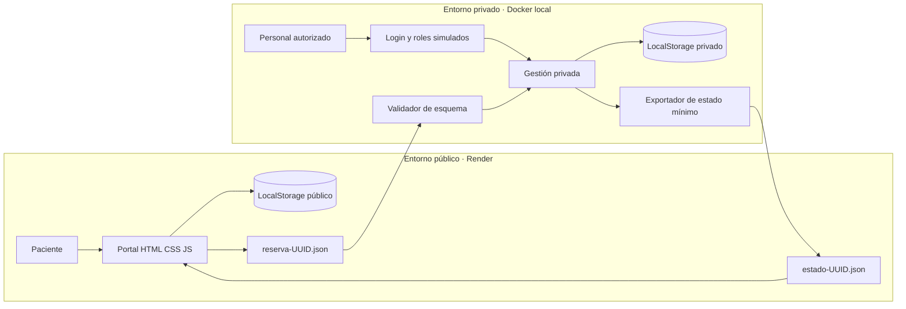

# Arquitectura híbrida académica

## Vista lógica

## Decisiones

1. **Separación de datos:** historias, diagnósticos, tratamientos, documentos administrativos completos y auditoría solo existen en `private-cloud`.
2. **Superficie pública mínima:** Render sirve páginas institucionales y campos necesarios para coordinar una cita; no tiene vistas ni scripts de historias clínicas.
3. **Intercambio por lista positiva:** los dos importadores aceptan esquemas exactos y rechazan claves adicionales, reduciendo la posibilidad de transportar datos médicos por error.
4. **Contenedores independientes:** Docker Compose usa contextos distintos. La imagen pública no puede copiar archivos de la carpeta privada porque su contexto es `./public-cloud`.
5. **Despliegue público único:** `render.yaml` declara un solo servicio con `rootDir: public-cloud`.

## Límites de confianza

- El navegador público es un entorno no confiable: cualquier usuario puede modificar su almacenamiento.
- El archivo JSON es no confiable hasta superar validaciones; aun validado, no está firmado.
- El navegador privado también es manipulable; el login y los roles solo demuestran el flujo de autorización.
- Render no recibe datos clínicos desde este código, pero LocalStorage público sigue siendo almacenamiento del dispositivo del usuario.

## Implementación real requerida

Una arquitectura de producción sustituiría el archivo por una API con TLS/mTLS, VPN o enlace privado, identidad robusta con MFA, autorización en servidor, base de datos, colas idempotentes, cifrado, gestión de claves, monitoreo, auditoría inmutable y cumplimiento normativo aplicable.
